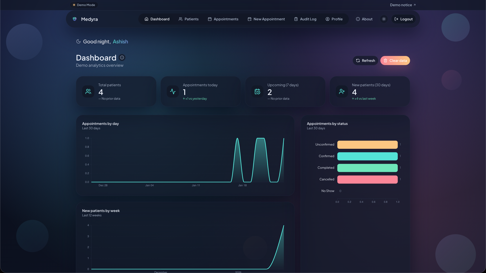
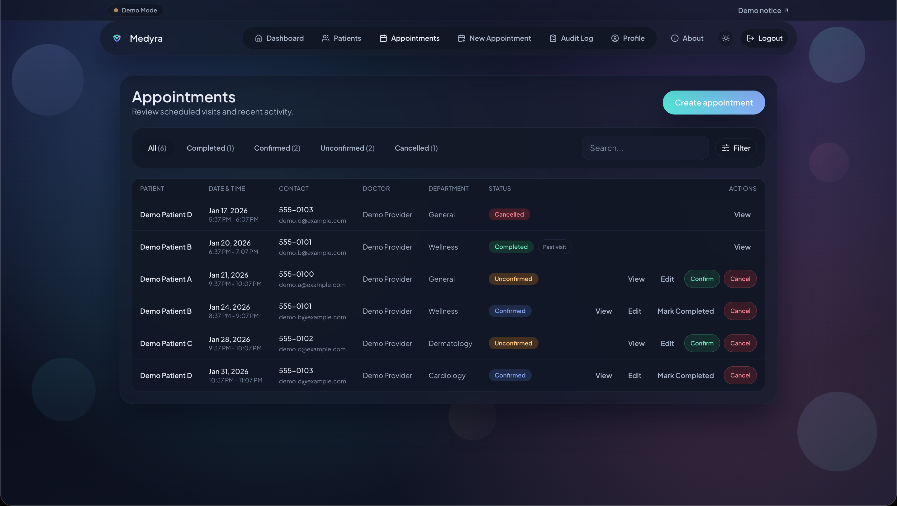
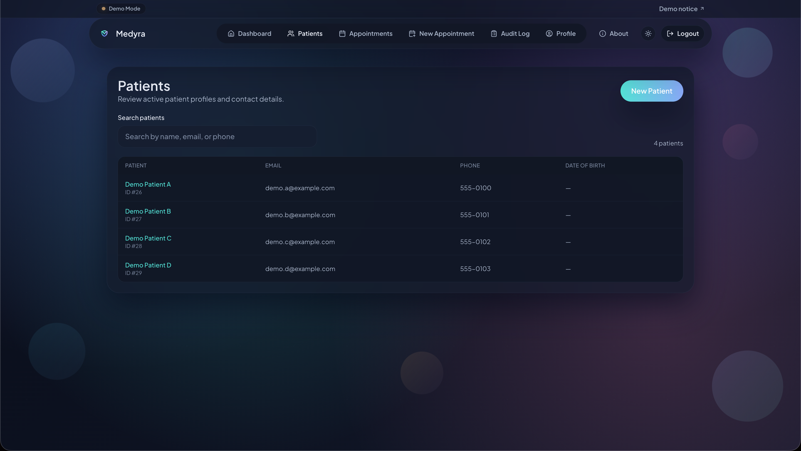
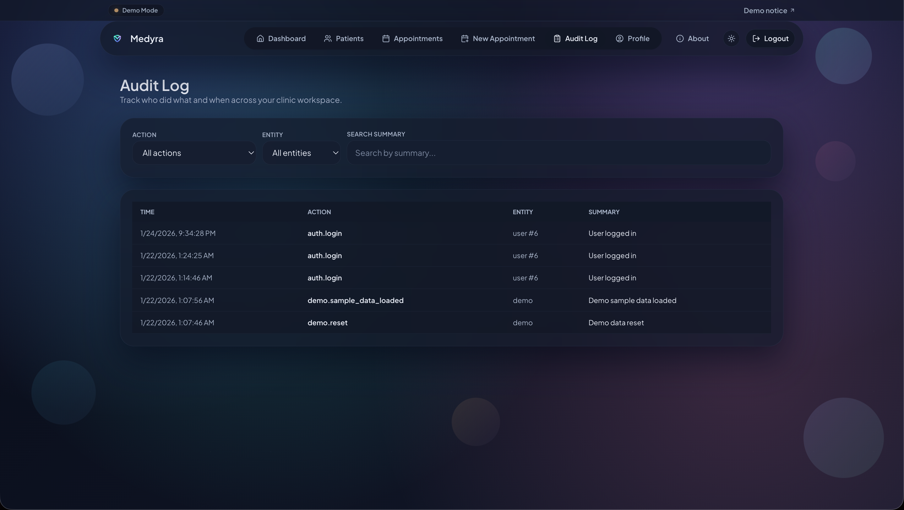

# Medyra

Medyra is a demo-first Electronic Medical Record (EMR) app for small clinics. It showcases full-stack engineering, UX, and product thinking through realistic workflows without handling real patient data.

Live Demo: https://example.com (placeholder)

## Academic Integrity & Usage Notice

This project is intended for learning, demonstration, and portfolio use. Please do not submit this code for coursework or assignments, or represent it as your own academic work. If you use or reference Medyra, provide proper attribution.

## What it does

- Auth for clinic staff with signup and login
- Patient records with demographics and notes
- Appointment scheduling with status lifecycle and actions
- Analytics dashboard with D3.js charts
- Audit log of key actions
- Demo reminders (simulated, no real messages)
- Guided tour for first-time users
- Sample data loading for instant demo content

## Demo Mode and Safety Disclaimer

Medyra is a demo application. Do not enter real patient data.

- Reminders are simulated and do not send real messages
- OTP email verification may be disabled for demo purposes
- Feature flags control demo-only tools and guardrails

## Key Features

- Multi-tenant isolation per user account
- Patients and appointments CRUD with status rules
- Audit logging for major actions
- Demo reset and sample data loading
- Glassmorphism UI with light and dark themes
- Mobile responsive layout
- Accessibility and keyboard support
- Feature flags for demo controls

## Tech Stack

- Frontend: React, TypeScript, Vite
- Backend: FastAPI, SQLAlchemy, Alembic
- Database: Postgres (Supabase compatible)
- DevOps: Docker Compose
- Hosting: Vercel (frontend), Cloud Run (backend)

## Local Development

### Prereqs

- Docker and Docker Compose
- Node.js 18+

### Run with Docker

```bash
docker compose up --build
```

Frontend: http://localhost:5173
Backend: http://localhost:8000
pgAdmin: http://localhost:5050

### Tests

```bash
cd backend && pytest
cd frontend && npm run build
```

## Contributing

See `CONTRIBUTING.md` for setup, workflow, and PR guidance. Engineering notes live in `docs/DEVELOPMENT.md`.

## Configuration and Feature Flags

These flags control demo and safety behavior. Use environment variables and do not commit secrets.

Frontend:

- `VITE_DEMO_MODE` shows demo UI indicators
- `VITE_ENABLE_EMAIL_OTP` enables the OTP UI flow
- `VITE_ENABLE_ACCOUNT_DELETION` shows Delete Account UI

Backend:

- `ENABLE_DEMO_RESET` enables demo reset endpoints
- `ENABLE_EMAIL_OTP` enables OTP requirement on signup
- `ENABLE_ACCOUNT_DELETION` enables account deletion

## Deployment (Free tier friendly)

### Frontend on Vercel

- Build from `frontend/`
- Set `VITE_API_BASE_URL` to your backend URL

### Backend on Cloud Run

- Build Docker image from `backend/`
- Set environment variables from your `.env` values
- Restrict CORS to your Vercel domain

### Database on Supabase

- Use a managed Postgres instance
- Set `DATABASE_URL` to the Supabase connection string

## Screenshots







## Roadmap and What is Next

Medyra is not HIPAA compliant today. Future work includes:

- HIPAA hardening and compliance controls
- Role-based access control
- Encrypted PHI storage
- Production-grade reminders and notifications
- FHIR integrations
- PWA support and offline mode

## Repo Structure

```
backend/
frontend/
docker-compose.yml
```

## License

TBD
